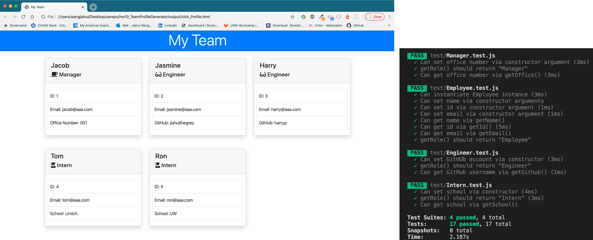

# Team Profile CLI Generator
* This is a software engineering team generator command line application. The application will prompt the user for information about the team manager and then information about the team members. The user can input any number of team members, and they may be a mix of engineers and interns. 
* When the user has completed building the team, the application will create an HTML file that displays a nicely formatted team roster based on the information provided by the user. 
* This CLI application passes all unit test.

## Built With
* OOP: constructors and prototype chain
* TDD (test driven-development)

## Development
* Integrate constructor functions into your applications, adding structure to your code and reducing the amount of code to write.
* Using OOP, separating data and functionality into different constructor functions that can be composed together.
* Verify your code works as intended through the use of automated tests by "npm run test"
* Build applications using test-driven-development, writing tests before implementing functionality.

## Demo

## Credits
University of Washington Coding Bootcamp faculty
* Instructor: Jason Rosen
* TA: Kris Shore
* TA: Daniel Mont-Eton

## License
MIT License

Copyright (c) [2019] [Jiahui Wang]

Permission is hereby granted, free of charge, to any person obtaining a copy
of this software and associated documentation files (the "Software"), to deal
in the Software without restriction, including without limitation the rights
to use, copy, modify, merge, publish, distribute, sublicense, and/or sell
copies of the Software, and to permit persons to whom the Software is
furnished to do so, subject to the following conditions:

The above copyright notice and this permission notice shall be included in all
copies or substantial portions of the Software.

THE SOFTWARE IS PROVIDED "AS IS", WITHOUT WARRANTY OF ANY KIND, EXPRESS OR
IMPLIED, INCLUDING BUT NOT LIMITED TO THE WARRANTIES OF MERCHANTABILITY,
FITNESS FOR A PARTICULAR PURPOSE AND NONINFRINGEMENT. IN NO EVENT SHALL THE
AUTHORS OR COPYRIGHT HOLDERS BE LIABLE FOR ANY CLAIM, DAMAGES OR OTHER
LIABILITY, WHETHER IN AN ACTION OF CONTRACT, TORT OR OTHERWISE, ARISING FROM,
OUT OF OR IN CONNECTION WITH THE SOFTWARE OR THE USE OR OTHER DEALINGS IN THE
SOFTWARE.

Ajax Autocomplete for jQuery is freely distributable under the terms of an MIT-style license. Copyright notice and permission notice shall be included in all copies or substantial portions of the Software.
